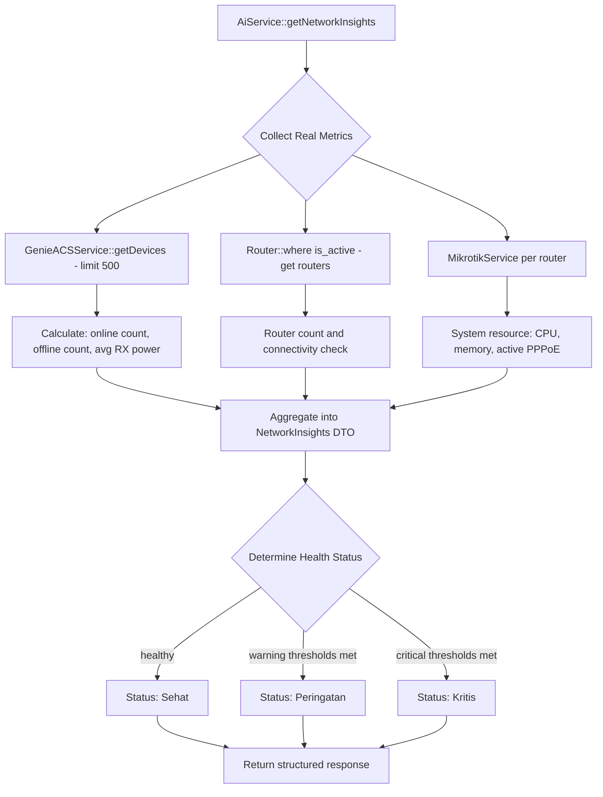
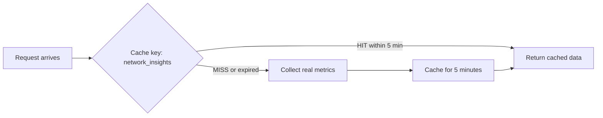

# Plan: Replace Fake Network Metrics with Real Data in AiService

## Problem Statement

[`AiService::getNetworkInsights()`](app/Services/AiService.php:532) currently returns **randomly generated** latency and packet loss values (`rand(5, 45)` and `rand(0, 2)`) and presents them to users as real "Network Health" insights in the AI dashboard and chat. This is misleading and undermines trust in the AI feature.

## Existing Real Data Sources (Already Available)

| Source | Service | Key Methods | Data Available |
|--------|---------|-------------|----------------|
| GenieACS NBI | [`GenieACSService`](app/Services/GenieACSService.php:9) | `getDevices()`, `getDeviceStatus()`, `ping()` | Online/offline status via `_lastInform`, RX Power via `VirtualParameters.RXPower`, device uptime, connected clients |
| Mikrotik RouterOS API | [`MikrotikService`](app/Services/MikrotikService.php:11) | `getSystemResource()`, `getPppoeActiveCount()`, `getInterfaceTraffic()` | CPU, memory, uptime, active PPPoE sessions, interface rx/tx bandwidth |
| Server System | [`SystemMetricsService`](app/Services/SystemMetricsService.php:5) | `getMetrics()` | Server CPU, RAM, swap usage |
| Network Monitor Job | [`NetworkMonitorJob`](app/Jobs/NetworkMonitorJob.php:15) | `handle()` | Periodic ONU online/offline checks, auto-ticket creation |
| Router Model | [`Router`](app/Models/Router.php:8) | DB fields | Host, port, location, is_active |

## Architecture

### Data Flow



### Caching Strategy



The AI dashboard already caches for 60 minutes via [`AiController::index()`](app/Http/Controllers/AiController.php:21). For `getNetworkInsights()` specifically, we should use a shorter TTL of 5 minutes since network state changes faster than sales data.

## Implementation Steps

### Step 1: Add a `getNetworkHealthSummary()` method to GenieACSService

Add a lightweight method that fetches all devices with minimal projection and returns online/offline counts plus average RX power.

```php
// In GenieACSService.php
public function getNetworkHealthSummary(): array
{
    $devices = $this->getDevices(500, 0);
    $now = Carbon::now();
    $onlineThreshold = 10; // minutes

    $online = 0;
    $offline = 0;
    $rxPowers = [];

    foreach ($devices as $device) {
        $lastInform = isset($device['_lastInform'])
            ? Carbon::parse($device['_lastInform']) : null;

        if ($lastInform && $lastInform->diffInMinutes($now) <= $onlineThreshold) {
            $online++;
        } else {
            $offline++;
        }

        // Collect RX Power from VirtualParameters
        $rxPower = $device['VirtualParameters']['RXPower']['_value'] ?? null;
        if (is_numeric($rxPower)) {
            $rxPowers[] = (float) $rxPower;
        }
    }

    return [
        'total_devices' => count($devices),
        'online' => $online,
        'offline' => $offline,
        'avg_rx_power' => !empty($rxPowers)
            ? round(array_sum($rxPowers) / count($rxPowers), 2) : null,
    ];
}
```

### Step 2: Add a `getAggregatedRouterHealth()` method that queries one or more routers

This queries one router if available and returns CPU, memory, active connections. To maintain performance, limit to querying the first active router only.

```php
// New helper method or inside AiService
// Use the primary/first active router only
$router = Router::where('is_active', true)->first();
if ($router) {
    $mikrotik = new MikrotikService($router);
    if ($mikrotik->isConnected()) {
        $resource = $mikrotik->getSystemResource();
        $activeCount = $mikrotik->getPppoeActiveCount();
    }
}
```

### Step 3: Rewrite `AiService::getNetworkInsights()`

Replace the `rand()` calls with real aggregated data:

```php
public function getNetworkInsights()
{
    return Cache::remember('ai_network_insights', 5, function () {
        // 1. GenieACS device health
        $deviceHealth = $this->genieService->getNetworkHealthSummary();

        // 2. Router health - query primary router
        $routerCount = Router::where('is_active', true)->count();
        $routerCpu = null;
        $routerMemory = null;
        $activePppoe = null;

        $primaryRouter = Router::where('is_active', true)->first();
        if ($primaryRouter) {
            try {
                $mikrotik = new MikrotikService($primaryRouter);
                if ($mikrotik->isConnected()) {
                    $resource = $mikrotik->getSystemResource();
                    $routerCpu = $resource['cpu-load'] ?? null;
                    $routerMemory = $resource ? round(
                        ((int)($resource['total-memory'] ?? 0) - (int)($resource['free-memory'] ?? 0))
                        / max(1, (int)($resource['total-memory'] ?? 1)) * 100
                    ) : null;
                    $activePppoe = $mikrotik->getPppoeActiveCount();
                }
            } catch (\Exception $e) {
                Log::warning('AI Network Insights - Router query failed: ' . $e->getMessage());
            }
        }

        // 3. Determine overall status
        $offlinePercent = $deviceHealth['total_devices'] > 0
            ? ($deviceHealth['offline'] / $deviceHealth['total_devices']) * 100 : 0;

        $status = 'Sehat';
        $message = 'Jaringan beroperasi dalam parameter normal.';
        $aiTip = 'Semua sistem operasional.';

        if ($offlinePercent > 20 || ($routerCpu !== null && $routerCpu > 80)) {
            $status = 'Kritis';
            $message = 'Masalah jaringan terdeteksi. ' . $deviceHealth['offline'] . ' perangkat offline.';
            $aiTip = 'Periksa OLT dan backbone fiber utama segera.';
        } elseif ($offlinePercent > 5 || ($routerCpu !== null && $routerCpu > 60)) {
            $status = 'Peringatan';
            $message = $deviceHealth['offline'] . ' perangkat offline dari total ' . $deviceHealth['total_devices'] . '.';
            $aiTip = 'Monitor perangkat offline dan kinerja router.';
        }

        // Peak hour adjustment
        $hour = Carbon::now()->hour;
        if ($hour >= 19 && $hour <= 22 && $status === 'Sehat') {
            $message .= ' Volume trafik tinggi (Jam Sibuk).';
            $aiTip = 'Pertimbangkan optimasi QoS untuk layanan streaming saat jam sibuk.';
        }

        return [
            'total_routers' => $routerCount,
            'devices_online' => $deviceHealth['online'],
            'devices_offline' => $deviceHealth['offline'],
            'devices_total' => $deviceHealth['total_devices'],
            'avg_rx_power' => $deviceHealth['avg_rx_power'],
            'router_cpu' => $routerCpu,
            'router_memory' => $routerMemory,
            'active_pppoe' => $activePppoe,
            'status' => $status,
            'message' => $message,
            'ai_tip' => $aiTip,
            // Keep these for backward compatibility with existing views
            'avg_latency' => null, // No longer faked; views should handle null
            'packet_loss' => null,
        ];
    });
}
```

### Step 4: Update the AI Dashboard View

Update [`resources/views/ai/index.blade.php`](resources/views/ai/) to display new real metrics:
- Replace latency/packet loss display with **devices online/offline ratio**
- Show **router CPU %** and **active PPPoE sessions**
- Show **avg RX power** if available
- Handle `null` values gracefully with N/A fallbacks

### Step 5: Update chat response in `processChat()`

The network chat handler at [`AiService.php:110-113`](app/Services/AiService.php:110) currently formats a string with `avg_latency` and `packet_loss`. Update it to use the new real fields:

```php
if (str_contains($message, 'network') || str_contains($message, 'jaringan')) {
    $data = $this->getNetworkInsights();
    $online = $data['devices_online'];
    $total = $data['devices_total'];
    $offline = $data['devices_offline'];
    $cpu = $data['router_cpu'] !== null ? $data['router_cpu'] . '%' : 'N/A';
    return "<b>Status Jaringan: {$data['status']}</b><br>"
         . "Perangkat Online: {$online}/{$total} | Offline: {$offline}<br>"
         . "Router CPU: {$cpu} | PPPoE Aktif: " . ($data['active_pppoe'] ?? 'N/A')
         . "<br><br><i>{$data['message']}</i>";
}
```

### Step 6: Also fix the critical review issues while we are here

These should be addressed in the same PR:

1. **XSS fix**: Apply `e()` escaping to all DB-derived values in HTML strings throughout [`AiService.php`](app/Services/AiService.php)
2. **N+1 fix**: Pre-load products with `whereIn` in [`getRestockSuggestions()`](app/Services/AiService.php:386)
3. **Rate limiting**: Add `throttle:30,1` middleware to the chat route in [`web.php:54`](routes/web.php:54)
4. **Remove debug logs**: Delete `\Log::debug()` calls from [`AtkProductController.php:51`](app/Http/Controllers/AtkProductController.php:51) and [`:161`](app/Http/Controllers/AtkProductController.php:161)

## Files to Modify

| File | Change |
|------|--------|
| [`app/Services/GenieACSService.php`](app/Services/GenieACSService.php) | Add `getNetworkHealthSummary()` method |
| [`app/Services/AiService.php`](app/Services/AiService.php) | Rewrite `getNetworkInsights()`, fix XSS, fix N+1, fix chat response |
| [`routes/web.php`](routes/web.php) | Add rate limiting middleware to chat route |
| [`app/Http/Controllers/AtkProductController.php`](app/Http/Controllers/AtkProductController.php) | Remove debug log statements |
| `resources/views/ai/index.blade.php` | Update dashboard cards for new metric fields |

## Risks and Mitigations

| Risk | Mitigation |
|------|------------|
| GenieACS server unreachable | Wrap in try/catch, return degraded response with status: Tidak Tersedia |
| Mikrotik router connection timeout | 30s timeout already configured; catch exception, skip router data |
| 500-device fetch is slow | Already cached for 5 minutes; could reduce to 200 if needed |
| Breaking existing AI dashboard view | Keep backward-compatible keys with null values |
